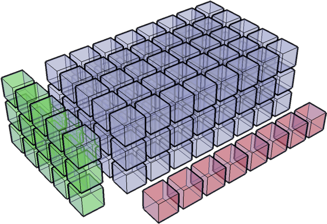

layout: false

.left-column[
  ## Data types and types

**Scalar types**: ``np.float64``, ``np.int32``, etc.

**Array scalars** (e.g. ``x[0]``) are somewhat special: each array scalar has
its own type (``np.float32``, ``np.uint32``, etc.) -- but also has an
attached dtype.  Acts as a bridge between arrays and Python scalars.

]
.right-column[
.up30[


- From this, we can build a dtype:
  ```
  # Build a 32-bit, Big Endian, floating point dtype
  d = np.dtype(np.float32).newbyteorder('>')
  ```
- Dtypes describe memory layout of arrays; i.e, all arrays are of type
  ``ndarray``, with attached data-type.
]]

---

.left-column[
  ## Strides
  
]

---
.left-column[
  ## Strides - transpose
  
]

---

.left-column[
  ## Broadcasting
]

.right-column[

Combine arrays of different shapes sensibly:

```
>>> x = np.zeros((3, 5))
>>> y = np.zeros(8)
>>> (x[..., np.newaxis] + y).shape
(3, 5, 8)
```



]

---

.left-column[
  ## Broadcasting compatibility
]

.right-column[

When combining two arrays of different shapes, shapes are matched from right to
left.  Match when:

- Dimensions are equal.
- One dimension is either None or 1.

```
   (5, 10)      (5, 10)    (5, 10, 1)
(3, 5, 10)      (6, 10)       (10, 5)
----------      -------    ----------
(3, 5, 10) OK   BAD        (5, 10, 5) OK
```
]

---

.left-column[
  ## Indexing with broadcasting
]

.right-column[

```
>>> x = np.array([[1, 2], [3, 4]])
array([[1, 2],
       [3, 4]])

>>> ix0 = np.array([0, 0, 1, 1])
>>> ix1 = np.array([[1], [0]])
array([[1],
       [0]])

>>> x[ix0, ix1]
array([[2, 2, 4, 4],
       [1, 1, 3, 3]])
```
```python
>>> np.broadcast_arrays(ix0, ix1)
[array([[0, 0, 1, 1],
       [0, 0, 1, 1]]),
 array([[1, 1, 1, 1],
       [0, 0, 0, 0]])]

```

.tip[.red[TIP] Best to avoid ``:`` and ``...`` in broadcasting--output shape is
sometimes hard to predict.]

]
